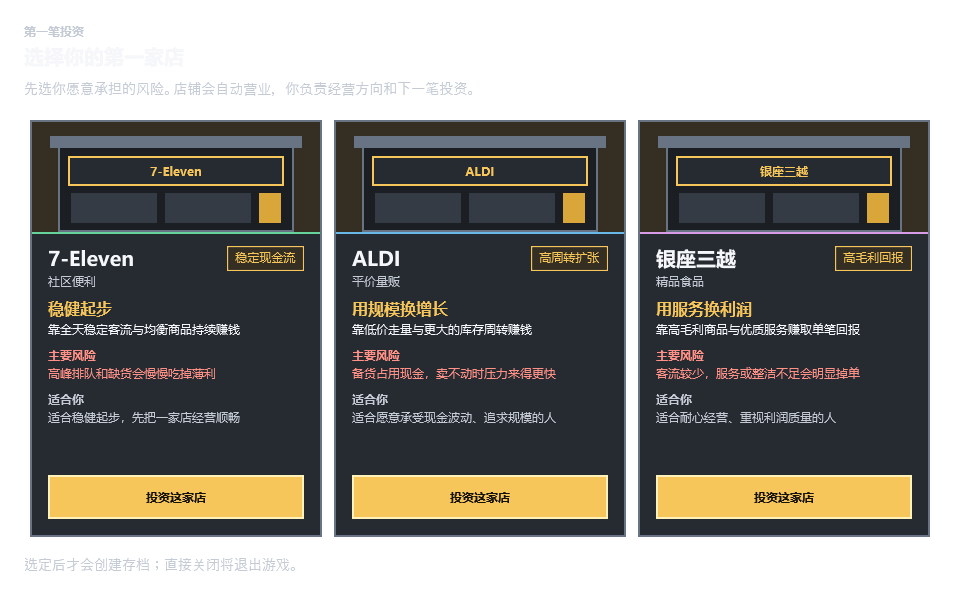
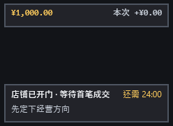
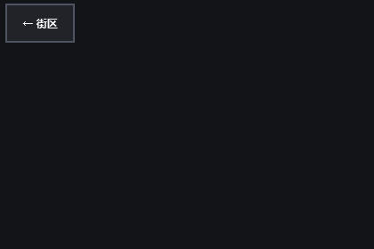
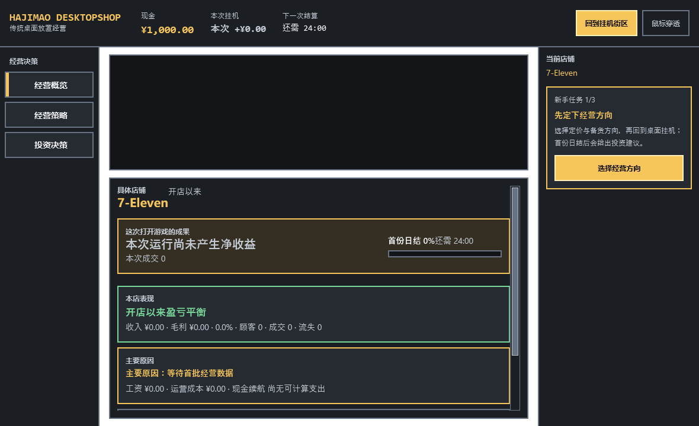
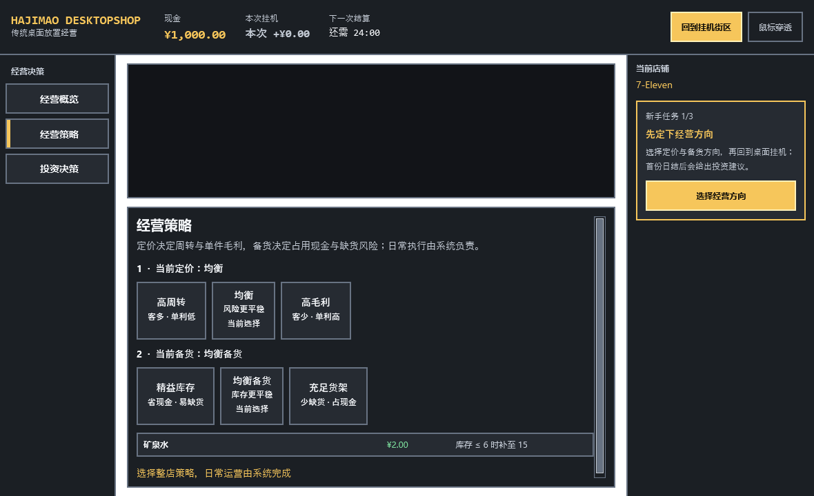
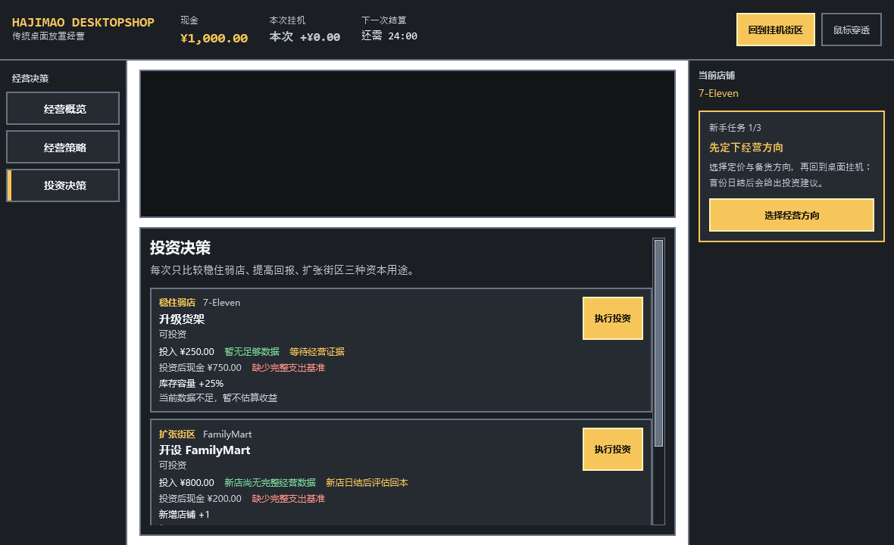

# v0.1.32 小重做体验审查

## 审查范围

- 路径：首次启动选店 → 街区挂机 → 进入具体店铺 → 经营概览 → 经营策略 → 投资。
- 目标：玩家打开后能立即知道该做什么，在短时间内看见第一笔经营反馈，并理解继续挂机与再次打开游戏的价值。
- 证据：本轮从当前源码重新生成的六张离屏截图。离屏管线不能渲染 Skia 店铺场景，因此不评价人物、货架和街景美术是否正常，只评价可见的窗口结构、文字、导航和反馈层。

## 总体结论

当前问题是核心流程顺序错误，不是单纯的视觉润色不足。游戏要求新玩家先理解店型风险、整店策略和投资证据，才可能看到经营结果；街区则先展示“+¥0、等待成交、还需 24:00”。玩家先收到零结果和说明文字，后收到玩法与奖励，因此不知道该做什么，也没有继续挂机的理由。

建议保留经营模拟、存档、内容目录、像素场景渲染、窗口置顶/拖动/吸附，重做首次十分钟内的玩家外壳。

## 1. 首店选择

健康度：较差。

- 三个店铺虽然有收益与风险差异，但卡片轮廓和信息结构几乎相同，视觉上仍像三份说明书。
- 三个同权重按钮重复“投资这家店”，没有默认推荐、试错保护或“选择后立即会发生什么”。
- 玩家尚未经历一次成交，就被要求理解现金流、规模周转和服务利润，决策发生得过早。
- 底部“直接关闭将退出游戏”强化退出风险，没有强化开始经营的期待。

## 2. 桌面街区

健康度：关键阻断。

- 第一眼是“本次 +¥0.00、等待首笔成交、还需 24:00”，主要信息全部是零结果和等待。
- “先定下经营方向”没有可见按钮或明确入口，玩家不知道点击店面、右键还是打开其他窗口。
- 缺少近期反馈：下一位顾客、最近一笔成交、连续营业进度、距离小目标还差多少。
- 24 分钟日结可以保留，但不能成为唯一可见进度。

## 3. 具体店铺

健康度：证据不足，结构风险高。

- 离屏管线没有渲染 Skia 店内场景，因此不能据此判断人物、货架或动画是否缺失。
- 可确认的是：除“返回街区”外，没有独立的状态摘要、店铺目标或进入经营决策的明显入口。
- 街区与具体店铺虽然技术上分成两页，但玩家目的没有分开：街区应看资产成长，店铺应看经营原因和做一次低频决策。

## 4. 经营概览

健康度：较差。

- 左侧导航、顶部状态、中央场景、中央卡片和右侧任务形成五个注意力区域。
- “选择经营方向”同时出现在左侧导航和右侧按钮，入口重复。
- 新档打开概览只得到零收益、零成交和“等待数据”，没有给玩家一个立即可理解的结果。
- 大量空间用于场景与报表容器，最重要的下一步只占右侧窄栏。

## 5. 经营策略

健康度：较差。

- 两组三选一形成九种组合，仍然像运营后台，而不是低频投资决策。
- 选项说明了客流、单利、现金和缺货，但没有展示“切换后本店预计会怎样”。
- 新玩家被要求先配置策略才能开始安心挂机，违背自动运营定位。
- 商品列表继续增加阅读量，却没有帮助完成当前决策。

## 6. 投资决策

健康度：较差。

- 页面一边提示“缺少完整支出基准、等待经营证据”，一边允许立即执行投资，信息与操作互相冲突。
- 多张密集候选卡没有突出一个当前推荐，也没有把投资后的街区变化作为奖励预览。
- 右侧仍提示先选经营方向，但投资按钮保持高强调，流程顺序没有被界面约束。

## 可见的可访问性风险

- 小字号辅助文字过多，低对比灰字承担了关键解释。
- 同一页面存在多个同权重黄色操作，主动作不稳定。
- 状态主要依赖文字和边框颜色；实际键盘顺序、读屏播报和动态更新仍需运行时验证。

## 小重做边界

### 保留

- Domain/Application 经营模拟、商品利润、员工效率与工资、事件、投资和多店数据。
- 当前存档 schema 与恢复路径。
- 街区/具体店铺双页面、像素渲染、24 帧人物动画。
- 桌面置顶、拖动、X 轴保持、任务栏吸附和鼠标穿透。
- 无离线收益、无倍速、现实时间固定 1x。

### 合并或删除

- 删除独立的新手任务栏，把下一步直接放进当前页面的主内容。
- 合并经营概览与经营策略；不再让玩家先看零数据报表。
- 商品级列表默认不展示，只在后台自动执行。
- 投资在获得首份有效经营证据前锁定为预览，不显示可执行的误导按钮。

### 重做后的核心路径

1. 选店：每店只显示“赚钱方式、主要风险、推荐人群”，提供一个明确推荐；选择后立即开始营业。
2. 街区：使用合理默认策略自动经营；10～20 秒内出现首位顾客/首笔成交反馈，持续显示最近成交和短目标。
3. 店铺：点击店面进入，只看人物货架、当前瓶颈和一个推荐决策。
4. 决策：把九种策略组合压缩成三个整店方向——稳健、扩张、利润；显示预计影响后一次确认。
5. 投资：先挂机获得证据，再出现一个推荐投资；执行后在街区和店铺场景中看到明确变化。

## 正反馈节奏

- 10～20 秒：第一位顾客或第一笔成交。
- 30～90 秒：本次收入、连续成交、下一短目标发生变化。
- 3～5 分钟：出现一次有证据的经营建议。
- 8～12 分钟：可承担第一笔明确投资。
- 24 分钟：完整日结，承担中期判断而不是首次反馈。
- 多日：新店、店型组合和街区长度构成长线目标。

这些节点不改变现实 1x，不提供离线收益，也不缩短完整经营日；只增加同一经营过程中的可见里程碑。

## 实施顺序

- 0.1.33：重排首次营业状态机、默认自动经营、短目标与反馈事件；先用纯 ViewModel 测试固定核心路径。
- 0.1.34：重做街区和具体店铺两页，合并管理入口，完成真实首次十分钟体验候选。
- 达到“新玩家不读说明也能完成首轮挂机—决策—投资”后，再恢复资源扩充和美术精修。
